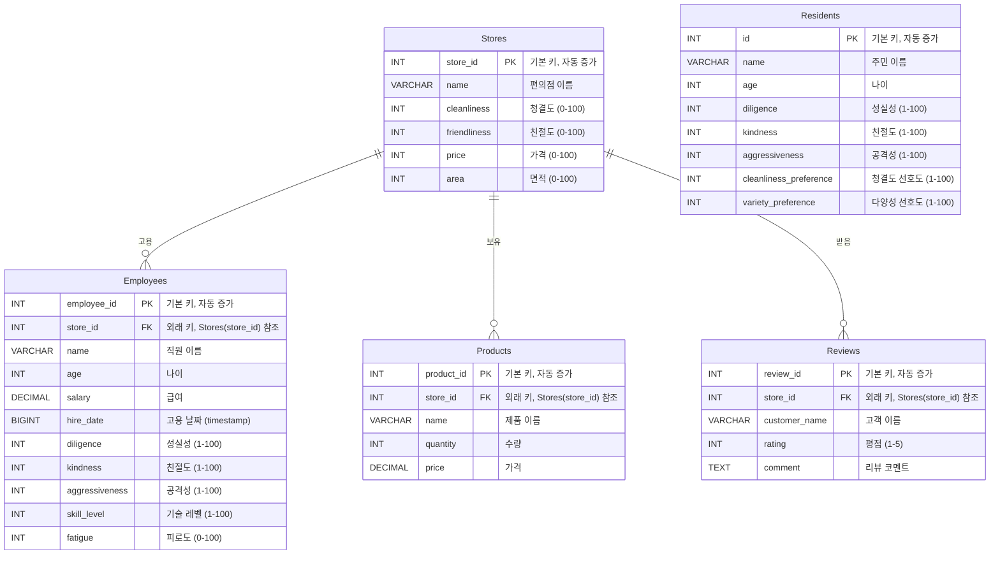

```mermaid
erDiagram
    Stores {
        INT store_id PK "기본 키, 자동 증가"
        VARCHAR name "편의점 이름"
        INT cleanliness "청결도 (0-100)"
        INT friendliness "친절도 (0-100)"
        INT price "가격 (0-100)"
        INT area "면적 (0-100)"
    }

    Residents {
        INT id PK "기본 키, 자동 증가"
        VARCHAR name "주민 이름"
        INT age "나이"
        INT diligence "성실성 (1-100)"
        INT kindness "친절도 (1-100)"
        INT aggressiveness "공격성 (1-100)"
        INT cleanliness_preference "청결도 선호도 (1-100)"
        INT variety_preference "다양성 선호도 (1-100)"
    }

    Employees {
        INT employee_id PK "기본 키, 자동 증가"
        INT store_id FK "외래 키, Stores(store_id) 참조"
        VARCHAR name "직원 이름"
        INT age "나이"
        DECIMAL salary "급여"
        BIGINT hire_date "고용 날짜 (timestamp)"
        INT diligence "성실성 (1-100)"
        INT kindness "친절도 (1-100)"
        INT aggressiveness "공격성 (1-100)"
        INT skill_level "기술 레벨 (1-100)"
        INT fatigue "피로도 (0-100)"
    }

    Products {
        INT product_id PK "기본 키, 자동 증가"
        INT store_id FK "외래 키, Stores(store_id) 참조"
        VARCHAR name "제품 이름"
        INT quantity "수량"
        DECIMAL price "가격"
    }

    Reviews {
        INT review_id PK "기본 키, 자동 증가"
        INT store_id FK "외래 키, Stores(store_id) 참조"
        VARCHAR customer_name "고객 이름"
        INT rating "평점 (1-5)"
        TEXT comment "리뷰 코멘트"
    }

    Stores ||--o{ Employees : "고용"
    Stores ||--o{ Products : "보유"
    Stores ||--o{ Reviews : "받음"
```
