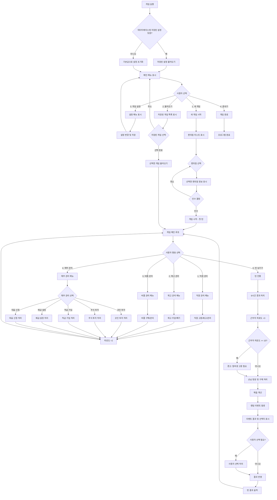

# FlowChart

```mermaid
flowchart TD
    A[게임 실행] --> B{데이터베이스에 저장된 설정 있음?}
    B -->|예| C[저장된 설정 불러오기]
    B -->|아니오| D[기본값으로 설정 초기화]
    C & D --> E[메인 메뉴 표시]
    E --> F{사용자 선택}
    F -->|1. 새 게임| G[새 게임 시작]
    F -->|2. 불러오기| H[저장된 게임 목록 표시]
    F -->|3. 게임 설정| I[설정 메뉴 표시]
    F -->|4. 끝내기| J[게임 종료]

    I --> K[설정 변경 및 저장]
    K --> E

    G --> L[편의점 리스트 표시]
    L --> M{편의점 선택}
    M --> N[선택한 편의점 정보 표시]
    N --> O{인수 결정}
    O -->|인수| P[게임 시작 - 첫 턴]
    O -->|취소| M

    P --> Q[게임 메인 루프]
    Q --> R{사용자 행동 선택}
    R -->|1. 직원 관리| S[직원 관리 메뉴]
    R -->|2. 재고 관리| T[재고 관리 메뉴]
    R -->|3. 비품 관리| U[비품 관리 메뉴]
    R -->|4. 재무 관리| V[재무 관리 메뉴]
    R -->|5. 턴 넘기기| W[턴 진행]

    S --> S1[직원 고용/해고/관리]
    T --> T1[재고 주문/폐기]
    U --> U1[비품 구매/관리]
    V --> V1{재무 관리 선택}
    V1 -->|코인 투자| V2[코인 투자 처리]
    V1 -->|주식 투자| V3[주식 투자 처리]
    V1 -->|적금 가입| V4[적금 가입 처리]
    V1 -->|예금 설정| V5[예금 설정 처리]
    V1 -->|대출 신청| V6[대출 신청 처리]

    S1 & T1 & U1 & V2 & V3 & V4 & V5 & V6 --> X[피로도 +2]
    X --> Q

    W --> Y[6시간 경과 처리]
    Y --> Z[근무자 피로도 +3]
    Z --> AA{근무자 피로도 >= 10?}
    AA -->|예| AB[경고: 알바생 고용 필요]
    AA -->|아니오| AC[손님 방문 및 구매 처리]
    AB --> AC
    AC --> AD[매출 계산]
    AD --> AE[랜덤 이벤트 발생]
    AE --> AF[이벤트 결과 및 선택지 표시]
    AF --> AG{사용자 선택 필요?}
    AG -->|예| AH[사용자 선택 처리]
    AG -->|아니오| AI[결과 반영]
    AH --> AI
    AI --> AJ[턴 결과 출력]
    AJ --> Q

    H --> AK{저장된 게임 선택}
    AK -->|선택 완료| AL[선택한 게임 불러오기]
    AK -->|취소| E
    AL --> Q

    J --> AM[프로그램 종료]
```
